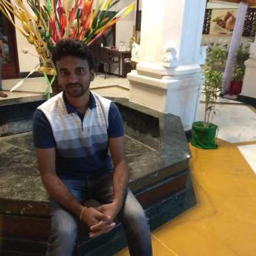


 

Hello there, Thanks for visiting my blog. I am Venkatesh working as SRE(Site Reliability Engineer). I spend most of my time solving distributed systems related problems and wondering how these systems work very well at a larger scale.

In leisure time I prefer reading books related to Telugu literature. Since Telugu is my mother tongue I love reading different books and traveling with the poet/author in his/her emotional journey. I like writing and I write all the things that intrigue me. Playing cricket and listening to music are my other activities.

you can reach me at venkytimmu@gmail.com